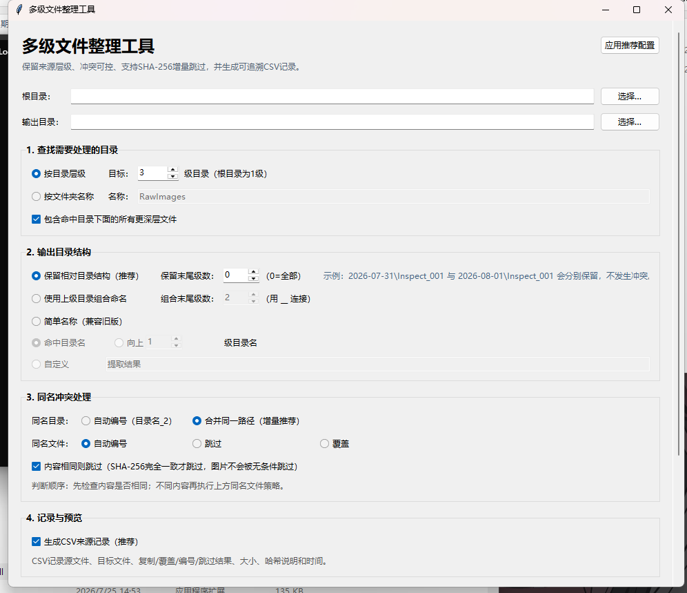

# 多级文件整理工具

一个面向 Windows 的中文图形化文件整理工具，可在复杂多级目录中按层级或文件夹名称查找目标目录，并按可追溯规则复制文件。



## 主要功能

- 按第 2、3、4 级等指定目录层级查找
- 递归查找指定名称的文件夹，直到最深层
- 保留完整或部分相对目录结构
- 使用多级上级目录组合命名
- 同名目录合并或自动编号
- 同名文件跳过、覆盖或自动编号
- SHA-256 内容完全相同才跳过
- 提取前预览目录映射和文件统计
- 每次运行生成 CSV 来源记录
- 支持取消任务和增量处理

## 推荐配置

- 输出结构：保留相对目录结构，保留级数为 `0`（全部）
- 同名目录：合并同一路径
- 同名文件：自动编号
- 内容相同则跳过：开启
- CSV 来源记录：开启
- 包含目标目录下更深层文件：开启

例如：

```text
源目录：
CaptureData\2026-07-31\Inspect_001\RawImages\a.bmp
CaptureData\2026-08-01\Inspect_001\RawImages\a.bmp

输出目录：
输出\2026-07-31\Inspect_001\RawImages\a.bmp
输出\2026-08-01\Inspect_001\RawImages\a.bmp
```

不同日期下的 `Inspect_001` 会保留各自来源路径，不需要依靠 `_2、_3` 猜测来源。

## SHA-256 跳过规则

图片不会因为扩展名或文件名相似而被无条件跳过：

1. 文件大小不同：内容不同，不跳过；
2. 文件大小相同：计算源文件和目标文件的 SHA-256；
3. SHA-256 完全一致：按“内容相同”跳过；
4. SHA-256 不一致：继续执行同名文件的编号、跳过或覆盖策略。

## 直接运行

下载并运行：

```text
dist\MultiLevelImageExtractor.exe
```

程序只复制文件，不删除、不移动、不修改源文件。

## 从源码运行

需要 Python 3，界面仅使用标准库 Tkinter：

```powershell
python bmp_extractor.py
```

## 打包 EXE

双击 `build_exe.bat`，或执行：

```powershell
py -3 -m pip install pyinstaller
py -3 -m PyInstaller --noconfirm --clean --onefile --windowed --noupx `
  --name MultiLevelImageExtractor `
  --distpath dist `
  --workpath build `
  --specpath . `
  bmp_extractor.py
```

完整中文使用说明见 [README.txt](README.txt)。

